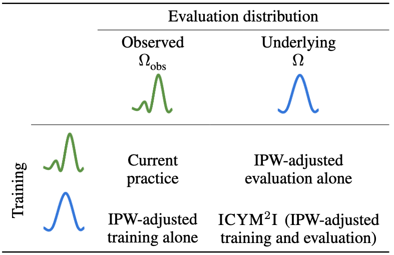

# ICYM2I: The illusion of multimodal informativeness under missingness

This repository contains the code used in [ICYM2I: The illusion of multimodal informativeness under missingness](), a framework for the evaluation of predictive performance and information gain under missingness through inverse probability weighting-based correction.

## Proposed methodology ICYM2I



Existing multimodality works have largely overlooked the problem of missingness. Naïve estimation of the information gain associated with including
an additional modality without accounting for missingness may result in improper estimates of that modality’s value in downstream tasks. Our work formalizes the problem of missingness in multimodal learning and demonstrates the biases resulting from ignoring this process. To address this issue, we introduce ICYM2I (In Case You Multimodal Missed It), a framework for the evaluation of predictive performance and information gain under missingness through double inverse probability weighting-based correction. 

## How to use ?
The following shows a pseudo code necessary to estimate performances under missigness shift.
```python
    from experiments.utils_classification import *

    # Estimate IPW weights: p_m is a vector of probability of being missing
    ipw = 1 / (1 - p_m)  
    ipw_train, ipw_val, ipw_test = ipw[X_train.index], ipw[X_val.index], ipw[X_test.index]

    # Train with IPW
    ipw_preds = train_mlp_and_get_prediction_probabilities(X_train, Y_train, X_val, Y_val, X_test, ipw_train, ipw_val)

    # Evaluate under IPW
    performance = get_classification_metric_dict(Y_test, ipw_preds, ipw_test)
```

After estimating predictions for each modalities with IPW correction (Y_X1, Y_X2 and Y_X12), one can estimate the PIDs as follows.
```python
    from information_decomposition import *
    # Estimate Q in set Delta_q
    estimator = QEstimator(X1_train, X2_train, X1_val, X2_val, 
                               Y_X1_train, Y_X2_train, Y_X1_val, Y_X2_val)

    # Compute PID with IPW correction
    pid_decomposition_batched(estimator, X1_test, X2_test, 
                              Y_X1_test, Y_X2_test, Y_X12_test,
                              Y_test, ipw_test)
```

## Experiments

### Synthetic
Our work demonstrates the importance of correcting for missingness on two sets of synthetic data:
- **Binary Logic** consists of generating binary modalities with AND, OR and XOR outcomes. As these are common examples in the PID literature, we show how biased existing methodologies are under missingness. To reproduce this set of experiments, use the notebook `experiments/run_logic.ipynb`. 
- **Simulations** are experiments that varies the contribution of the different modalities, allowing to study the alignment between corrected PID and performance, and the true values obtained on the underlying distribution. To create the data, use the notebook `experiments/generate_simulation_data.ipynb`. To run the set of experiment, use the notebook `experiments/run_simulation.ipynb`. Note that this notebook takes 12 hours of compute time on GPU.

### Semi-synthetic experiments
We use the version of [UR-Funny](https://github.com/ROC-HCI/UR-FUNNY) available from [Multibench](https://github.com/pliang279/MultiBench?tab=readme-ov-file) available [here](https://drive.google.com/drive/folders/1Agzm157lciMONHOHemHRSySmjn1ahHX1). In the proposed semi-synthetic experiment, we enforce missingness in the video modality given the text and demonstrates how performances and PID decomposition are biased under missingness. To reproduce this experiment, use the notebook `experiments/run_humour.ipynb`. 

### Structural heart disease detection
Due to the policies of our clinical center, we are unable to share the data we used for our structural heart disease (SHD) experiments. For completeness, we include general processing steps for users who have access to their own paired posteroanterior (PA) view chest X-ray (CXR) DICOM files and standard 12-lead electrocardiograms (ECGs) with associated transthoracic echocardiogram-generated SHD labels. Please note that our center's ECGs were saved as `.npy` files.

0. Setup the CXR and ECG environments through `fairseq_signals_env.yaml` and `tf.yaml`, respectively.
1. Collect [ELIXR](https://huggingface.co/google/cxr-foundation) and [ECG-FM](https://github.com/bowang-lab/ECG-FM) model weights from `HuggingFace`.
    - We recommend reading the [`fairseq-signals` repository](https://github.com/Jwoo5/fairseq-signals) for ECG-FM.
2. Generate respective modality embeddings through `shd_deidentified/generate_cxr_embeddings_deidentified.ipynb` and `shd_deidentified/generate_ecg_embeddings_deidentified.ipynb.ipynb`.
3. Use `experiments/run_ecg+cxr.ipynb` to reproduce our results. While the data is not available, this notebook serves as a tutorial to apply the different corrections on your own dataset.

## Setup

## Requirements
All requirements are available as a `conda` enviornment under `clinical_pid_env.yaml`.
Additionally, the structural heart disease detection task requires the `fairseq_signals_env.yaml` and `tf.yaml` environments for electrocardiogram and chest radiograph embedding models, respectively.
